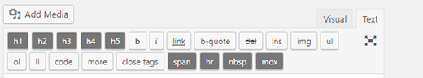

# === Quicktags for WP ===  

Contributors: brtak  
Donate link: <https://paypal.me/DavidKlhufek>  
Tags: quicktags, html editor, edit, classic editor  
Tested up to: 6.8  
Stable tag: 1.4.5  
License: GPLv2 or later  
License URI: <http://www.gnu.org/licenses/gpl-2.0.html>  

This simple plugin adds useful buttons to the native WordPress HTML editor.  

== Description ==  

This simple plugin adds useful buttons to the native WordPress HTML editor (Classic Editor).  

Currently adds:  
h1, h2, h3, h4, h5, span, hr, nbsp, mox  

The "mox" button adds a nice responsive CSS class which you can use to highlight pictures or other elements in your posts.  

**Note:** This plugin works only with the Classic Editor. It does not support the new Gutenberg (Block Editor).  

== Compatibility ==  

- Requires the Classic Editor to be active.  
- Designed specifically for the **HTML mode** of the editor.  

== Installation ==  

1. Unzip into your `/wp-content/plugins/` directory. If you're uploading it, make sure to upload the top-level folder. Don't just upload all the PHP files and put them in `/wp-content/plugins/`.  
2. Activate the plugin through the 'Plugins' menu in WordPress.  
3. Ensure the Classic Editor is active if you want to use the enhanced Quicktags buttons.  

== Frequently Asked Questions ==  

**Does this plugin work with Gutenberg (Block Editor)?**  

No, this plugin is designed specifically for the Classic Editor. If you are using Gutenberg, the plugin's functionality will not be available.  

**What does the "mox" button do?**  

The "mox" button adds a `
` with a responsive CSS class that can be styled to highlight images or other elements in your posts.  

== Screenshots ==  

== Changelog ==

= 1.4.5 =

- Moved the `Requires Plugins: classic-editor` declaration from `readme.txt` to the main PHP file to properly enforce plugin dependencies.  

= 1.4.4 =  

- Added dependency check for the Classic Editor plugin, ensuring it is active and displaying a warning if not.
- Updated the plugin code to include Text Domain for translation support.

= 1.4.3 =  

- Updated code to comply with WordPress Coding Standards using PHPCS.  

= 1.4.2 =  

- Fixed header placement and added PayPal donate link.

= 1.4.1 =  

- Removed the "b" button as it was redundant in newer versions of the Classic Editor where this functionality is already included by default.
- Added the "span" button before the "hr" button.  

= 1.4 =  

- Complete rewrite of the plugin according to new guidelines.  
- Changed the plugin name to "Quicktags for WP".  
- Prevented direct file access by adding security checks to all PHP files.  
- Updated function names to use a unique prefix `wpqt_` to avoid conflicts with other plugins.  
- Improved code readability and maintainability by standardizing naming conventions.  
- Resolved potential conflicts with other plugins by ensuring all function names, classes, and options are unique.  

= 1.3 =  

- Updated readme.txt, fixed small typo errors  

= 1.2 =  

- Updated readme.txt, fixed small typo errors  

= 1.1 =  

- Updated screenshots, fixed Uncaught ReferenceError: QTags is not defined

= 1.0 =  

- Public release  

== Upgrade Notice ==  

No need to update, it's a stable version.  
